# 🗺️ Developer Journey: Azure DevOps → GitHub Repos Migration

> **Scenario**: Repositories migrated to GitHub to leverage Copilot coding agent capabilities. Pipelines, Boards, and Artifacts remain in Azure DevOps.

---

## 📊 Hybrid Platform Map

| Component | Platform | Why |
|---|---|---|
| **Source Code & Repos** | **GitHub** | Copilot coding agent, Copilot Chat, PR reviews |
| **CI/CD Pipelines** | **Azure DevOps** | Existing pipeline investments, approvals, environments |
| **Work Items / Boards** | **Azure DevOps** | Sprint planning, backlog management, tracking |
| **Artifacts / Packages** | **Azure DevOps** | Internal NuGet/npm feeds |

---

## 1. 🏗️ High-Level Hybrid Architecture

```mermaid
block-beta
    columns 3
    
    space:3
    
    block:azure["☁️ AZURE DEVOPS"]:1
        columns 1
        boards["📋 Boards & Sprints"]
        pipelines["🔄 CI/CD Pipelines"]
        artifacts["📦 Artifacts / Feeds"]
        testplans["📊 Test Plans"]
    end    
    
    block:connection["🔗 INTEGRATION LAYER"]:1
        columns 1
        sc["Service Connection"]
        abref["AB# Work Item References"]
        webhooks["Webhooks & Status Checks"]
    end    
    
    block:github["🐙 GITHUB"]:1
        columns 1
        repos["📂 Source Code Repos"]
        copilot["🤖 Copilot Chat & Agent"]
        prs["👀 Pull Requests & Reviews"]
        security["🔒 Advanced Security"]
    end    
    
    azure --> connection
    connection --> github

    style azure fill:#0078d4,color:#fff
    style github fill:#24292e,color:#fff
    style connection fill:#f0ad4e,color:#000
```



---

## 2. 🔄 Developer Journey — Swimlane Flow

```mermaid
flowchart TD
    subgraph ADO_BOARDS["📋 AZURE DEVOPS BOARDS"]
        A["🎯 Pick Work Item\nfrom Sprint Backlog\n(AB#12345)"]
        H["✅ Close Work Item\nAB#12345 → Done"]
    end

    subgraph GITHUB["🐙 GITHUB"]
        B["🔀 Create Feature Branch\nfeature/AB#12345-user-profile"]
        C["🤖 Code with Copilot\nCopilot Chat + Agent in IDE"]
        D["📤 Push & Open Pull Request\nReference AB#12345 in description"]
        E["👀 Code Review\nCopilot Review + Team Approval"]
        G["✅ Merge Pull Request\nSquash & Merge to main"]
    end

    subgraph ADO_PIPELINES["🔄 AZURE DEVOPS PIPELINES"]
        F["🔨 CI Build + Tests\nTriggered via GitHub webhook\nStatus reported back to PR"]
        I["🚀 CD Deployment\nDeploy to staging/production\nApprovals & gates"]
    end

    A --> B
    B --> C
    C --> D
    D --> E
    D -.->|"Triggers"| F
    F -.->|"Status Check ✅❌"| E
    E --> G
    G -.->|"Triggers"| I
    I --> H

    style ADO_BOARDS fill:#0078d4,color:#fff
    style GITHUB fill:#24292e,color:#fff
    style ADO_PIPELINES fill:#0078d4,color:#fff
    style A fill:#2196f3,color:#fff
    style H fill:#4caf50,color:#fff
    style B fill:#333,color:#fff
    style C fill:#333,color:#fff
    style D fill:#333,color:#fff
    style E fill:#333,color:#fff
    style G fill:#4caf50,color:#fff
    style F fill:#2196f3,color:#fff
    style I fill:#ff9800,color:#fff
```



---

## 3. 🔴🟢 Before vs. After Comparison

```mermaid
flowchart LR
    subgraph BEFORE["🔴 BEFORE — All Azure DevOps"]
        direction TB
        B1["📋 Plan\nAzure DevOps Boards"] --> B2["💻 Code\nAzure DevOps Repos\n❌ No AI Assistance"]
        B2 --> B3["👀 Review\nAzure DevOps PRs\n❌ Manual Only"]
        B3 --> B4["🔨 Build\nAzure DevOps Pipelines"]
        B4 --> B5["🚀 Deploy\nAzure DevOps Pipelines"]
    end

    subgraph AFTER["🟢 AFTER — Hybrid"]
        direction TB
        A1["📋 Plan\nAzure DevOps Boards\n✂️ No Change"] --> A2["💻 Code\n⭐ GitHub Repos\n✅ Copilot Chat & Agent"]
        A2 --> A3["👀 Review\n⭐ GitHub PRs\n✅ Copilot Review\n✅ Advanced Security"]
        A3 --> A4["🔨 Build\nAzure DevOps Pipelines\n✂️ Source = GitHub"]
        A4 --> A5["🚀 Deploy\nAzure DevOps Pipelines\n✂️ No Change"]
    end

    style BEFORE fill:#ffebee,color:#000
    style AFTER fill:#e8f5e9,color:#000
    style B1 fill:#0078d4,color:#fff
    style B2 fill:#d32f2f,color:#fff
    style B3 fill:#d32f2f,color:#fff
    style B4 fill:#0078d4,color:#fff
    style B5 fill:#0078d4,color:#fff
    style A1 fill:#0078d4,color:#fff
    style A2 fill:#2e7d32,color:#fff
    style A3 fill:#2e7d32,color:#fff
    style A4 fill:#0078d4,color:#fff
    style A5 fill:#0078d4,color:#fff
```



---

## 4. 🔗 Integration Touchpoints — Sequence Diagram

```mermaid
sequenceDiagram
    actor Dev as 👩‍💻 Developer
    participant ADO_B as 📋 Azure DevOps<br/>Boards
    participant GH as 🐙 GitHub<br/>Repos & PRs
    participant COP as 🤖 GitHub<br/>Copilot
    participant ADO_P as 🔄 Azure DevOps<br/>Pipelines

    Dev->>ADO_B: 1. Pick Work Item (AB#12345)
    ADO_B-->>Dev: Sprint task assigned
    
    Dev->>GH: 2. Create branch (feature/AB#12345)
    Dev->>COP: 3. Code with Copilot Chat & Agent
    COP-->>Dev: AI suggestions, code generation
    
    Dev->>GH: 4. Push code & Open PR
    Note over GH: PR references AB#12345
    
    GH->>ADO_P: 5. Webhook triggers CI Pipeline
    ADO_P->>ADO_P: 6. Build + Run Tests
    ADO_P-->>GH: 7. Report status check ✅/❌
    
    GH->>COP: 8. Copilot reviews PR
    COP-->>GH: Review suggestions
    
    Dev->>GH: 9. Address feedback & Merge PR
    
    GH->>ADO_P: 10. Merge triggers CD Pipeline
    ADO_P->>ADO_P: 11. Deploy to staging/prod
    
    ADO_P-->>ADO_B: 12. Update Work Item → Done
    
    Note over Dev,ADO_P: 🔁 Cycle repeats for next work item
```



---

## 5. 🤖 Copilot Capabilities — What Developers Gain

```mermaid
mindmap
  root((🤖 GitHub Copilot<br/>Capabilities))
    💻 Copilot Chat
      Code suggestions in IDE
      Explain existing code
      Generate unit tests
      Refactor assistance
      Documentation generation
    🤖 Copilot Coding Agent
      Assign tasks from Issues
      Autonomous implementation
      Creates PRs with changes
      Multi-file changes
      Runs tests & iterates
    👀 Copilot Code Review
      Auto-review on PR creation
      Security suggestions
      Best practice enforcement
      Performance improvements
    🔒 Advanced Security
      Secret scanning
      Code scanning CodeQL
      Dependabot alerts
      Supply chain security
```



---

## 6. ⏱️ Developer Daily Timeline

```mermaid
gantt
    title 👩‍💻 Developer Daily Workflow
    dateFormat HH:mm
    axisFormat %H:%M

    section 📋 Azure DevOps Boards
        Check sprint backlog & pick task     :active, boards1, 09:00, 15min
        Update work item status              :boards2, 17:00, 10min

    section 🐙 GitHub
        Create feature branch                :gh1, 09:15, 5min
        Code with Copilot assistance         :gh2, 09:20, 180min
        Open Pull Request                    :gh3, 12:30, 15min
        Address review feedback              :gh4, 14:00, 60min
        Merge PR after approval              :gh5, 16:00, 10min

    section 🔄 Azure DevOps Pipelines
        CI build & tests (automated)         :pipe1, 12:45, 20min
        CD deployment (automated)            :pipe2, 16:10, 30min

    section 👀 Reviews
        Review teammate PRs on GitHub        :rev1, 13:00, 45min
        Copilot auto-review runs             :rev2, 12:45, 10min
```



---

## 👩‍💻 Step-by-Step Developer Workflow

### Phase 1: Planning (Azure DevOps Boards)
1. Open Azure DevOps Boards and check the sprint backlog
2. Pick a work item (e.g., `AB#12345 - Add user profile endpoint`)
3. Note the **Work Item ID** — this is the linking mechanism between platforms

### Phase 2: Coding (GitHub + Copilot)
1. Clone the repo from **GitHub**:
   ```bash
   git clone https://github.com/org-name/my-service.git
   ```
2. Create a feature branch referencing the work item:
   ```bash
   git checkout -b feature/AB#12345-user-profile-endpoint
   ```
3. Code with **GitHub Copilot**:
   - **Copilot Chat** in IDE for suggestions, explanations, and test generation
   - **Copilot Coding Agent** for autonomous task implementation
4. Commit with work item references:
   ```bash
   git commit -m "feat: add user profile endpoint AB#12345"
   ```

### Phase 3: Pull Request & Review (GitHub)
1. Push and open a **Pull Request on GitHub**
2. Include `AB#12345` in the PR description for traceability
3. **Copilot Code Review** automatically suggests improvements
4. Team reviews, discusses, and approves on GitHub
5. Azure DevOps Pipeline status checks appear in the PR

### Phase 4: CI/CD (Azure DevOps Pipelines)
1. Pipeline triggers automatically via GitHub webhook
2. Build and test results report back to the GitHub PR as status checks
3. After merge, CD pipeline deploys to staging/production
4. Approvals and gates remain in Azure DevOps

### Phase 5: Closure (Azure DevOps Boards)
1. Work item `AB#12345` is updated to **Done**
2. Sprint burndown and velocity tracked in Azure DevOps

---

## ⚠️ Key Things to Remember

1. **Repos are now on GitHub** — update your `git remote` URLs
2. **Always reference `AB#<ID>`** in branch names, commits, and PRs for traceability
3. **Code reviews happen on GitHub**, not Azure DevOps
4. **Pipelines still run in Azure DevOps** — status appears in GitHub PR checks
5. **Work items and sprints stay in Azure DevOps** — no change to planning workflow
6. **Use Copilot!** — It's the primary reason for this migration

---

## 🔧 Pipeline Configuration (azure-pipelines.yml)

Your Azure DevOps Pipeline should be configured to trigger from GitHub:

```yaml
trigger:
  branches:
    include:
      - main
      - feature/*

pr:
  branches:
    include:
      - main

resources:
  repositories:
    - repository: self
      type: github
      endpoint: 'MyGitHubServiceConnection'

stages:
  - stage: Build
    jobs:
      - job: BuildAndTest
        pool:
          vmImage: 'ubuntu-latest'
        steps:
          - checkout: self
          - script: echo "Building from GitHub repo"
          - script: echo "Running tests"

  - stage: Deploy
    dependsOn: Build
    jobs:
      - deployment: DeployToStaging
        environment: 'staging'
        strategy:
          runOnce:
            deploy:
              steps:
                - script: echo "Deploying to staging"
```

---

*Last updated: 2026-02-13*